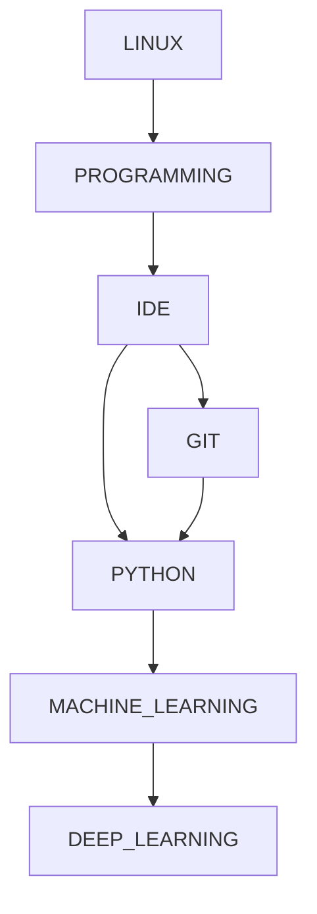

# The Big Picture



# Programming

- Linux
  - Terminal
- C++
  - Basics
- Python
- Git - Version Control System.
  - GitHub
  - GitLab
- IDE - Visual Studio Code, Sublime, Vim...
- Skill: To Learn
- Web programming
- **Data Science**
  - Machine Learning
    - deep learning
      - Convolutional Neural Network

## C++

```Bash
## terminal bash
g++ -o myprogram.exec myprogram.C
```

## Python

```Bash
## terminal bash
$ python myprogram.py
```


# Resources

- [20 Basic Linux Commands for Beginners!](https://medium.com/100-days-of-linux/20-basic-linux-commands-for-beginners-78516ab936d6)

- [How to Learn C++: The Complete Guide for Beginners](https://medium.com/educative/how-to-learn-c-the-complete-guide-for-beginners-eb26b20c7ff0)
- [C++ tutorials](https://www.cplusplus.com/doc/tutorial/variables/)

- [w3schools](https://www.w3schools.com/python/default.asp)