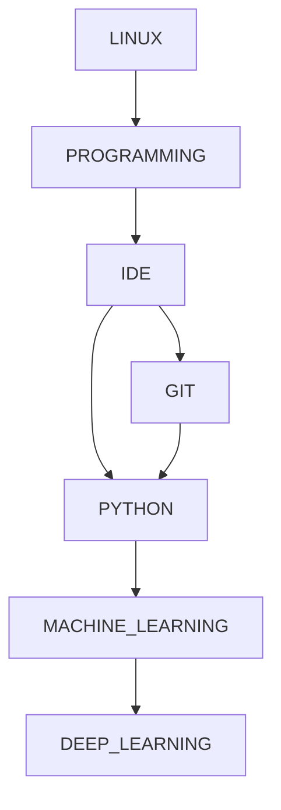

# The Big Picture - To study



# Programming

### Table of Contents

- Linux
  - Terminal
- C++
  - Basics
- Python
- Git - Version Control System.
  - GitHub
  - GitLab
- IDE - Visual Studio Code, Sublime, Vim...
- Skill: To Learn
- Web programming
- **Data Science**
  - Machine Learning
    - deep learning
      - Convolutional Neural Network

## C++

```Bash
## terminal bash
$ cd C++/
g++ -o myprogram.exec myprogram.C
```

## Python

```Bash
## terminal bash
$ cd python 
$ python myprogram.py
```

## Bash Script

```Bash
## terminal bash
$ cd bash
$ source screenshot.sh
```


# Resources

### Programming
- [Introduction to programming](https://beknazarsuranchiyev.medium.com/introduction-to-programming-56dda6a1cbd7)


### Git

- [ Version Control System(VCS)](https://git-scm.com/)
- [The 13 Git Commands I Use Daily](https://medium.com/analytics-vidhya/13-git-commands-i-use-daily-14e3ad562068)
### Python
- [w3schools](https://www.w3schools.com/python/default.asp)
- [Learning Python: From Zero to Hero](https://medium.com/the-renaissance-developer/learning-python-from-zero-to-hero-8ceed48486d5)

##### Pandas
- [The Mastery of Pandas - I](https://medium.com/swlh/the-mastery-of-pandas-i-50156db42125)

- [The Mastery of Pandas - II](https://medium.com/analytics-vidhya/the-mastery-of-pandas-ii-bc4cf58c04f5)

 
### Linux

- [20 Basic Linux Commands for Beginners!](https://medium.com/100-days-of-linux/20-basic-linux-commands-for-beginners-78516ab936d6)
- [Basic Linux command line tutorial to start developing in Ubuntu Linux](https://medium.com/@zibon/basic-linux-command-lines-to-get-started-developing-in-ubuntu-linux-b54def1c2190)

### C++

- [How to Learn C++: The Complete Guide for Beginners](https://medium.com/educative/how-to-learn-c-the-complete-guide-for-beginners-eb26b20c7ff0)
- [C++ tutorials](https://www.cplusplus.com/doc/tutorial/variables/)

### Data Science and Machine Learning
- [Notes On Using Data Science & Machine Learning](https://chrisalbon.com/#machine_learning)

  - **Machine Learning - Basics**
  - Vectors, Matrices, And Arrays
  - Preprocessing Structured Data
  - Preprocessing Images
  - Preprocessing Text
  - Preprocessing Dates And Times
  - Feature Engineering
  - Feature Selection
  - Model Evaluation
  - Model Selection
  - Linear Regression
  - Logistic Regression
  - Trees And Forests
  - Nearest Neighbors
  - Support Vector Machines
  - Naive Bayes
  - Clustering
  - **Deep Learning**
    - Setup
    - Keras
    - PyTorch
  - **Python** 
    - Basics
    - Data Wrangling
    - Data Visualization
    - Web Scraping
    - Testing
    - Logging
  - **Statistics**
    - Basics
    - Frequentist
    - Scala
    - Regular Expressions
  - **Snowflake**
    - Basics
    - Tables
  - **PostgreSQL**
    - Basics
    - Add, Delete, Change Rows
    - Merging And Joining
    - Tables
    - Text
    - Numeric
    - Dates
    - Interview Questions
  - **Mathematics**
  - **AWS** Amazon Web Services (AWS) - Cloud Computing Services
  - **Computer Science**
    - Algorithms
  - **Linux Command Line**
    - Basics
    - Inputs And Outputs
    - Search
    - Text
    - Flow Control
    - Processes
    - Shell Scripts
  - **Git And GitHub**
  - **Machine Learning Engineering**
  - **Kubeflow**
  - **Docker**
  - **Dockerfiles**
  - PHP
