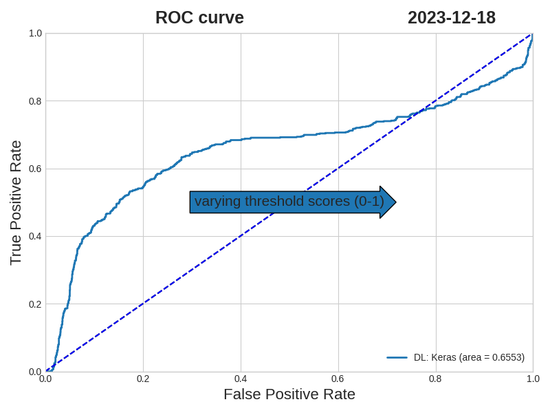
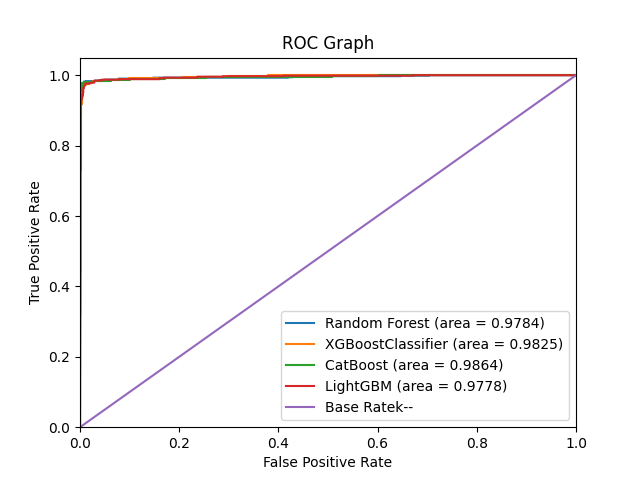

## Data Science

```bash 
@andvsilva
```
To study 

 - Dataset
 - Explore data
 - Feature Selection/Engineering
 - Modeling 
 - Machine Learning

```bash
source dataset: https://www.kaggle.com/code/bashirabubakar/human-resources-analytics-employee-attrition/notebook
```

### Requirements

```bash
# author: @andvsilva sáb 09 dez 2023 10:34:19
pip install pipreqs

# to create file requirements on the folder
pipreqs ~/repo/programming/notebooks

# requirements.txt libraries for the project
catboost==1.1.1
Faker==18.9.0
feather==0.1.2
feather_format==0.4.1
icecream==2.1.3
ipython==8.18.1
matplotlib==3.7.0
numpy==1.24.4
pandas==1.3.5
scikit_learn==1.3.2
seaborn==0.13.0
snoop==0.4.3
streamlit==1.19.0
tqdm==4.66.1
varname==0.12.2


# Just run this command to install
# the libraries for the project.
~/repo/programming/notebooks on  master! ⌚ 10:31:12
pip install -r requirements.txt 
```

```
Two files to performance the cleaning and modeling:

- exploredata.ipynb
- modeling.ipynb
- bestmodels.ipynb

Modeling
@andvsilva - sáb 09 dez 2023 16:36:53

Testing and Results
- Logistic Regression
- Random Forest 
- Decision Tree
- AdaBoost Model
- XGBClassifier
- LightGBM
- CatBoostClassifier
```

```bash
drop the column: Emp ID.
```

### Results

For the models listed above and I found the following results:

Applying the Receiver Operating Characteristic (**ROC**) curve is a graphical representation used in binary and multi-class classification problems to assess the performance of a classification model at various thresholds.

#### Here is a basic interpretation of the ROC curve:

- **Top-Left Corner**: Ideal scenario where the model has a high true positive rate and a low false positive rate across various thresholds.

- **Bottom-Right Corner**: Represents a model that performs no better than random chance.

- **Diagonal Line**: Represents the performance of a random classifier.


```bash
## @andvsilva - 10 dez 2023 19:14:35
-------------------------Metrics-----------------------
LogisticRegression model:
accuracy........:75.7%
score...........:63.69
Mean Absolute Error: 0.24333
-------------------------------------------------------
Random Forest model:
accuracy........:98.9%
score...........:98.96
Mean Absolute Error: 0.01133
-------------------------------------------------------
Decision Tree model:
accuracy........:96.2%
score...........:94.88
Mean Absolute Error: 0.038
-------------------------------------------------------
AdaBoost model:
accuracy........:95.19%
score...........:93.82
Mean Absolute Error: 0.04767
-------------------------------------------------------
XGBClassifier model:
accuracy........:98.9%
score...........:98.53
Mean Absolute Error: 0.01133
-------------------------------------------------------
CatBoostClassifier model:
accuracy........:99.1%
score...........:98.85
Mean Absolute Error: 0.00867
-------------------------------------------------------
LightGBMClassifier model:
accuracy........:98.6%
score...........:98.34
Mean Absolute Error: 0.014
-------------------------------------------------------
```


## Deep Learning - Keras.

```bash
@andvsilva 10 dez 2023 22:09:15

Working in progress! The next step is to workaround, the parameters.

Keras is not so good yet!
```

### Results




## Selecting the best models &rarr; metrics:




```bash
@andvsilva 11 dez 2023

the BEST model according to metrics: 'CatBoost Classifier'

CatBoostClassifier model:
accuracy........:99.1%
score...........:98.85
Mean Absolute Error: 0.00867
Area under curve (AUC): 99.41 %

## Cross Validation to catboost.
https://www.geeksforgeeks.org/catboost-cross-validation-and-hyperparameter-tuning/
```


```bash
# install streamlit to make an app:

pip install streamlit

# go to the folder:
cd programming/notebooks/apptoprod

$ streamlit run turnover.py           

  You can now view your Streamlit app in your browser.

  Local URL: http...
  Network URL: ...
```

You to access the URL http://...:... to see your app working. :smiley: Now enjoy!
